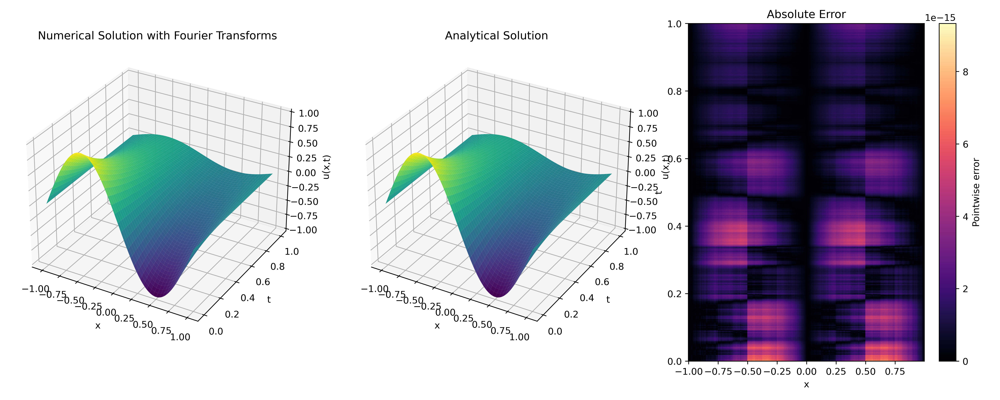

# ACM@UIC SIG-MATH Fourier transforms project

This repository is a "from-scratch" implementation of the Fourier Transforms engine that support both the basic single-threaded algorithms all the way to SIMD/SIMT (GPU) accelerations.  

> [!NOTE]
> The goal of this project is mainly educational. We seek to explore the understanding of the Fourier Transforms from blackboard math all the way to code implementation while also exploring different aspects of effective optimization techniques accross different archtectures and computing paradigms.

## Compiling and running

The library currently supports two execution pathways:
1. Native binary compilation
1. Python bindings

Each pathway supports two compute modes:
- `basic`: standard single-threaded CPU execution
- `CUDA`: NVIDIA GPU acceleration using SIMT parallelism.

### Binary compilations
With native binary compilations, the source files are at `src/<mode>/` and we have scaffold the basic `Makefile` script with the common optimizations turned on.
- `make run_basic` will compile and run the single-threaded execution binary.
- `make run_cuda` (requires CUDA) will compile and run the CUDA execution binary.

### Python bindings
The library supports Python interoperability of C++ and CUDA codes through the [pybind11](https://github.com/pybind/pybind11). The main modules for our package will be that of `sigMathFourier` for `basic` mode and `sigMathFourierCUDA` for the `CUDA` mode. 

To compile the module, execute the `python-modules/make-<mode_bindings>.sh` script. And to use it, place the resulting shared library (`.so` file) to a place where the Python interpreter can see.

## Applications to Solving Differential Equations
We also explore applications of the Fourier Transforms numerical solutions of differential equations, as an introductory look into the world of the Spectral Methods. All of the sources pertaining to this excursions are listed at `pde/` directories. A few notable examples are

### [Hasegawa-Wakatani turbulence](pde/hasegawa-wakatani/)
https://github.com/user-attachments/assets/0651d64f-2e68-484e-a926-76dd4e83a5ef

### [Heat equation](pde/heat)

## Requirements
- C++ >=20 compatible compiler (i.e. `g++` or `clang++`)
- Python
- For `CUDA`:
    - NVIDIA GPU.
    - The CUDA Toolkit (either from [Nvidia](https://developer.nvidia.com/cuda/toolkit) or [Spack](https://spack.io/))

## Contribute

Of course, feel free to contribute in a way you see fit via [pull-request](https://docs.github.com/en/pull-requests/collaborating-with-pull-requests/proposing-changes-to-your-work-with-pull-requests/creating-a-pull-request). We recommend forking the repository and make pull requests from you fork.

In particular, we are looking forward to expand the backend horizon (OpenMP, AVX, SYCL,...) of our "from-scratch" apporach and also resolving the repository issues.
